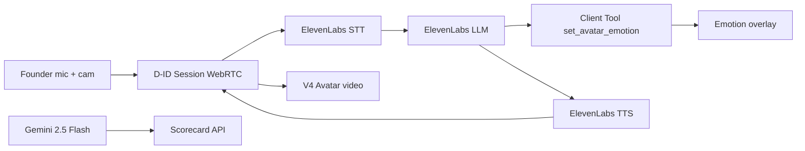

# PitchBack

Emotional investor avatar pitch coach — D-ID V4 avatar + ElevenLabs Agents + Gemini scorecard.

## Quick start

1. Copy env template and fill keys:

```bash
cp .env.example .env.local
```

2. **ElevenLabs** (×3 agents, one per persona):
   - Create agents at [elevenlabs.io](https://elevenlabs.io) → Agents
   - Add **Client tool** `set_avatar_emotion` (see README)
   - Copy each `agent_id` into `ELEVEN_AGENT_ID_*` in `.env.local`
   - On each session, PitchBack **syncs** persona prompts + voices from `lib/persona-prompts.ts` into those agents (D-ID only renders the avatar). Set `ELEVEN_SYNC_AGENTS=false` to use dashboard settings only.

3. **D-ID avatars**: Set one `presenter_id` per VC in `.env.local`:
   - `D_ID_PRESENTER_SKEPTIC` → Marcus Chen
   - `D_ID_PRESENTER_EXCITED` → Sarah Kim
   - `D_ID_PRESENTER_OPERATOR` → James Okafor

   Browse IDs: `GET https://api.d-id.com/expressives/avatars` or D-ID Studio → Expressive avatars.

4. **D-ID keys**: Add `D_ID_API_KEY` and `ELEVENLABS_API_KEY`. On first session, PitchBack auto-registers your ElevenLabs key as a **D-ID secret**.
5. **Gemini**: Add `GEMINI_API_KEY` for post-session scoring (`gemini-2.5-flash`).

```bash
bun install
bun dev
```

Open http://localhost:3000 — each VC uses their own avatar + ElevenLabs agent.

## Architecture



## API routes

- `POST /api/create-session` — wires D-ID agent via `/v2/agents/integrations/elevenlabs` with `vision.enabled: true`
- `POST /api/evaluate` — scores transcript with Gemini (body: `{ transcript }` or `{ conversationId }`)
